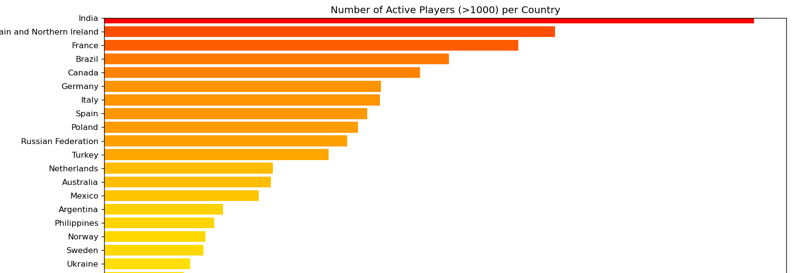
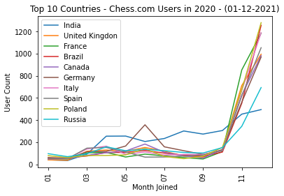
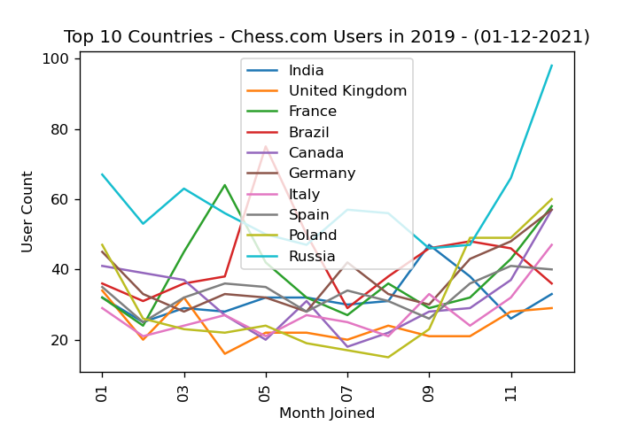
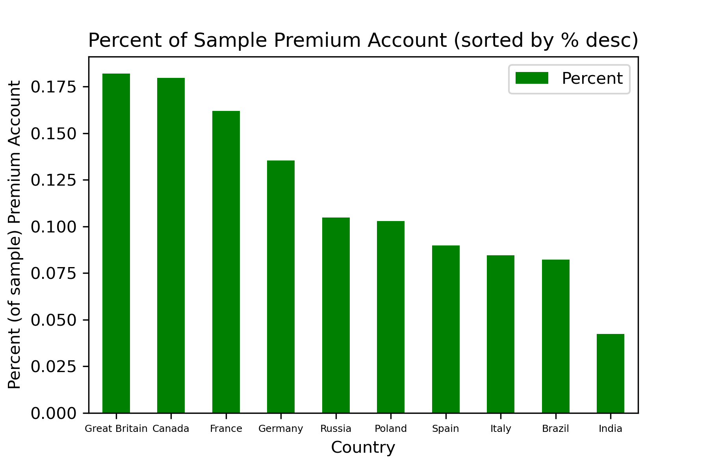
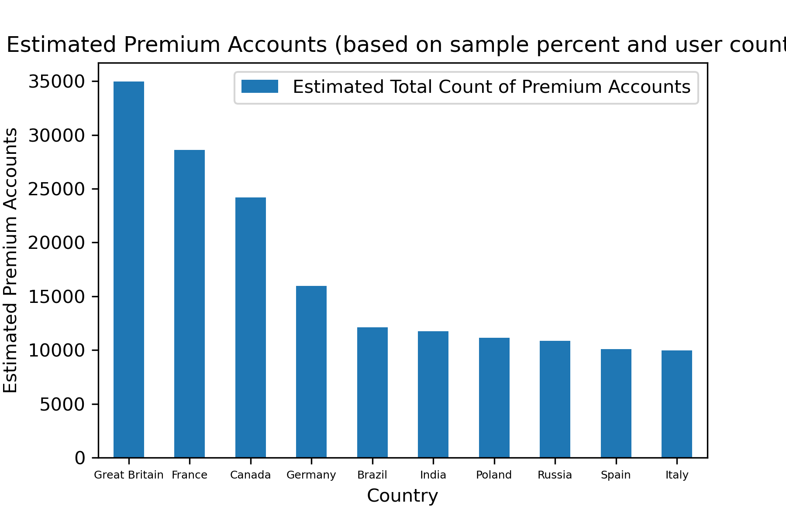
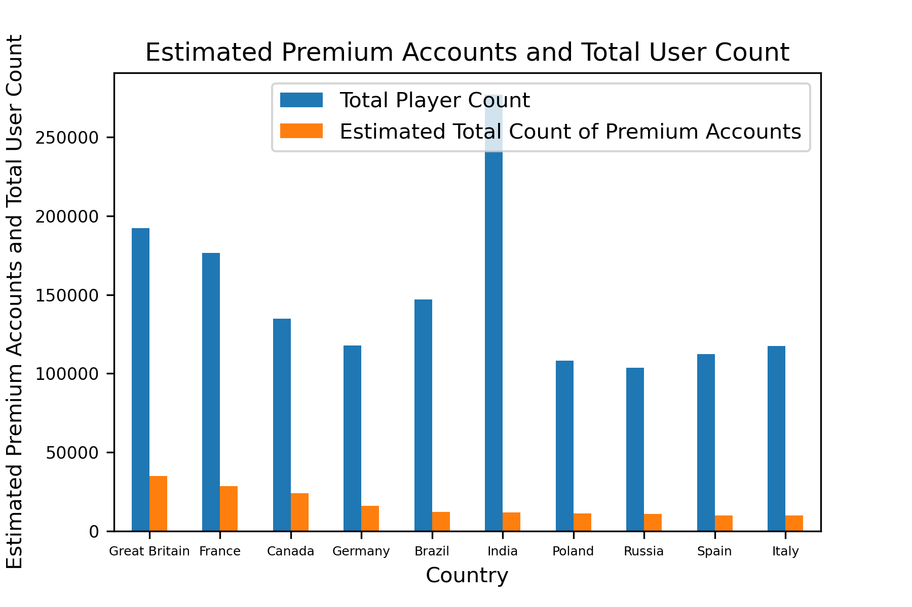
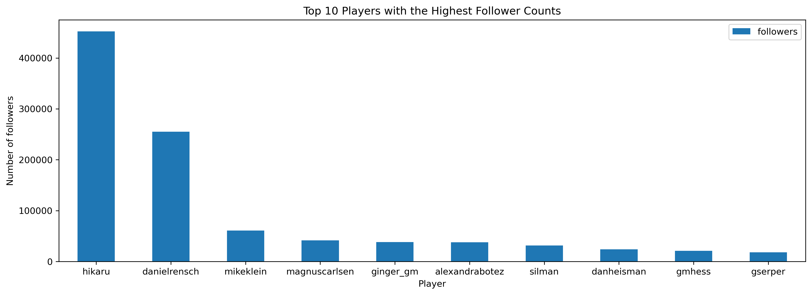
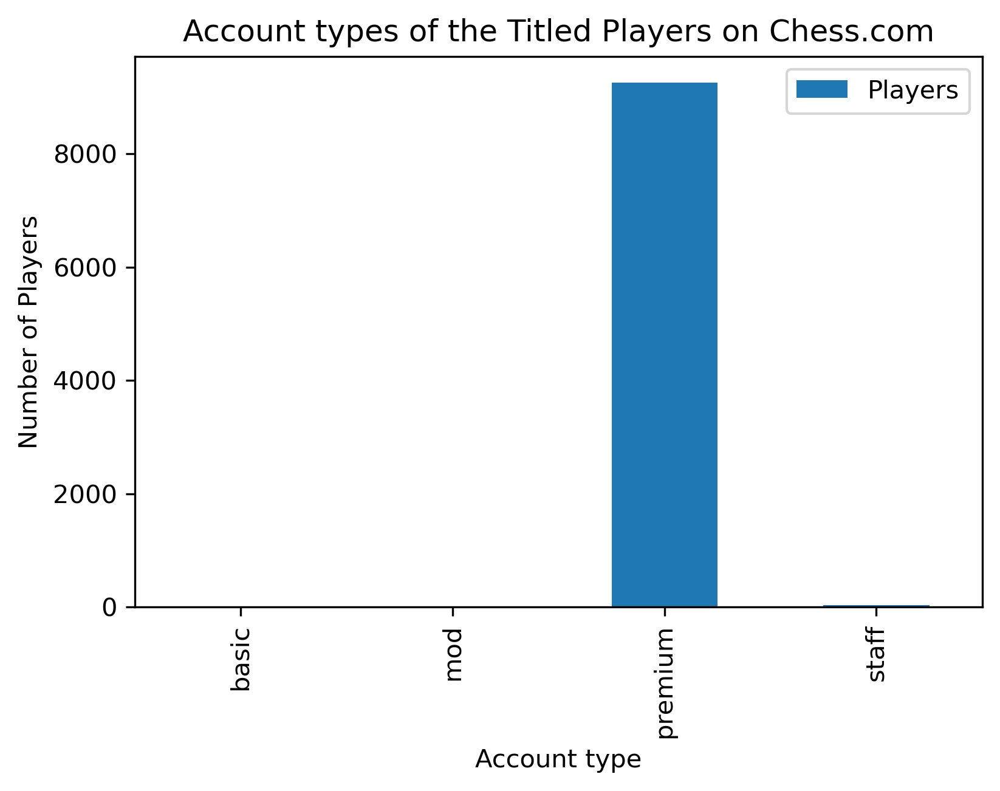
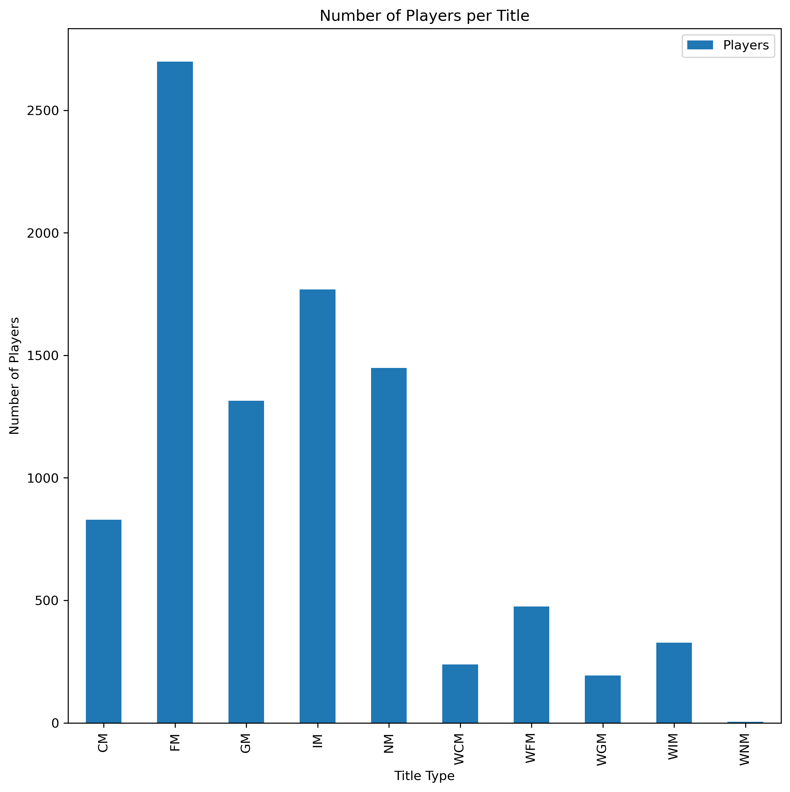

### Team Data Knights: Checkmate!
# Project I - Who plays chess?

## Background

Whether financial, political, or social -- data's true power lies in its ability to answer questions definitively. In this group project, we've utilized Python requests, APIs, and JSON traversals to answer a question: "Who plays chess?"

## Motivation and Summary

* Initially we wanted to see if The Queen's Gambit release on Netflix had an influence on the popularity of chess.
* Reevaluated available data sources and settled on the question: Who plays chess on chess.com?
* Determined this by asking:

    a. Where is it the most popular and who has the most users (by country)?
    
    b. Of those users, which country has the highest percent of premium accounts?
    
    c. What country has the most titled users?
    
    d. Of the titled users, which are most popular?
    
    e. Compare the amount of users who joined in 2019 vs. 2020

Able to answer? Yes! 

## Questions & Data

    1. Of the recently joined users and online users on chesss.com, where is it the most popular? most users? (by country)

    2. Of these users, which country has the highest percent of premium accounts ($99/year)?

    3. What country has the most titled users?

    4. Of the titled users, who are the most popular for each title? (top 10 w/ the most followers) 

    5. Top 10 countries with the most active and joined users in 2019 and 2020?

    
Data Needed:
* Players data that includes their country of origin, joined date, account status, account type and their title.
* Found data on the chess.com api. 

## Data Cleanup & Exploration

ChessPy

Imported our dependencies and set our file paths 
resources : country codes from website matching ISO country code and mapping country nam
Used the chess.com api for players by country and created a function to get a list of current/recently added player names from each country and exported to to csv 
Created a function to call on the same api to get get a list of all player details (in all countries) that are titled players and exported to csv 
Once we had a list of all the usernames, we chose the top 10 countries.
Created a function to create a sample of usernames from each of our chosen countries for 15% of usernames if under 5000, or 5000 for countries over. 
Once we had the sample size, we pulled the player data for each player in the sample per country, created a df and exported to csv’s

Chess Details 

Imported dependencies and set our files paths to read in (each of the player details csv’s)
Country player count 
Defined function to get the player joined dates, and put the date in month/year format  for top 10 countries 
Grouped the joined year/month data frames and performed a count on each to see how many 
Converted datetime from epoch time to regular date format 
Narrowed down the data to find the joined data for 2019/2020
Create data-frames for each country to show the joined date, then plotted the join dates of the top 10 countries in a line plot .

## Data Analysis

### Country Player Count

* Used the chess.com api for players by country and created a function to get a list of current/recently added player names from each country and exported to to csv. 

### Top 10 Country Player Count

* Sorted the data frame by player count in descending order to get the top 10 countries with the highest player count.

### Percent of Country on chess.com

* Sourced the most current country population count data from worldpop and saved as a csv. 

* Read in the csv and created a data frame of the countries with the 2019 population only. 

* Format country names to match those of the chess player count. 

* Merged chess player count df with country population on country.

* Calculated the percent of population the chess.com players account for 

### Players Joined (2020) - Top 10

### Players Joined (2020) - Top 10

### Percent of Sample w/ Premium Account

### Estimated Premium Account Total

### Estimated Premium Accounts & Total User Count

### Titled Players

* Grouped the titled players data-frame by account type to see how many of the titled users in the top 10 countries had basic, mod, premium or staff accounts and plotted it in a bar chart

* Grouped titled players by rank title and plotted the count of each rank.

* Grouped data frame by country to see how many titled players there are in each country, dropped the ones with no significant number.

## Discussion

* Even though the api only has currently active users along with recently joined, there are significantly more who joined still in 2020 than 2019.

* May show a correlation to Queen’s Gambit Netflix release date.
The Data was incomplete due to incomplete data.

* The Data Analysis incomplete due to incomplete data.

