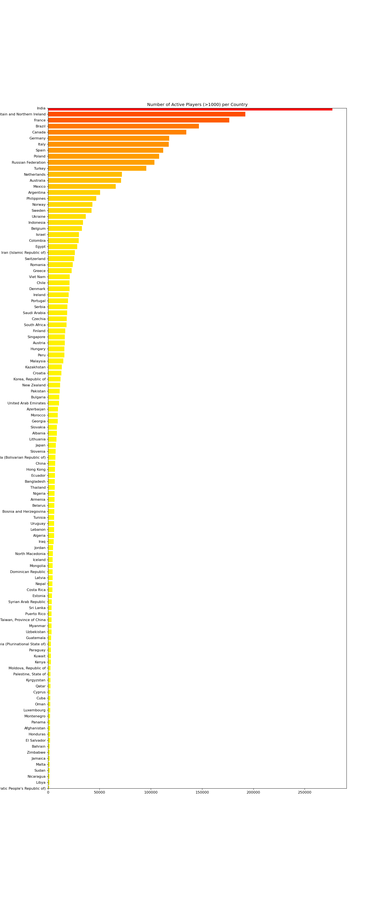

### Team Data Knights: Checkmate!
# Project I - Who plays chess?

## Background

Whether financial, political, or social -- data's true power lies in its ability to answer questions definitively. In this group project, we've utilized Python requests, APIs, and JSON traversals to answer a question: "Who plays chess?"

## Motivation and Summary

* Initially we wanted to see if The Queen's Gambit release on Netflix had an influence on the popularity of chess.
* Reevaluated available data sources and settled on the question: Who plays chess on chess.com?
* Determined this by asking:

    a. Where is it the most popular and who has the most users (by country)?
    
    b. Of those users, which country has the highest percent of premium accounts?
    
    c. What country has the most titled users?
    
    d. Of the titled users, which are most popular?
    
    e. Compare the amount of users who joined in 2019 vs. 2020

Able to answer? Yes! 

## Questions & Data

    1. Of the recently joined users and online users on chesss.com, where is it the most popular? most users? (by country)

    2. Of these users, which country has the highest percent of premium accounts ($99/year)?

    3. What country has the most titled users?

    4. Of the titled users, who are the most popular for each title? (top 10 w/ the most followers) 

    5. Top 10 countries with the most active and joined users in 2019 and 2020?

    
Data Needed:
* Players data that includes their country of origin, joined date, account status, account type and their title.
* Found data on the chess.com api. 

